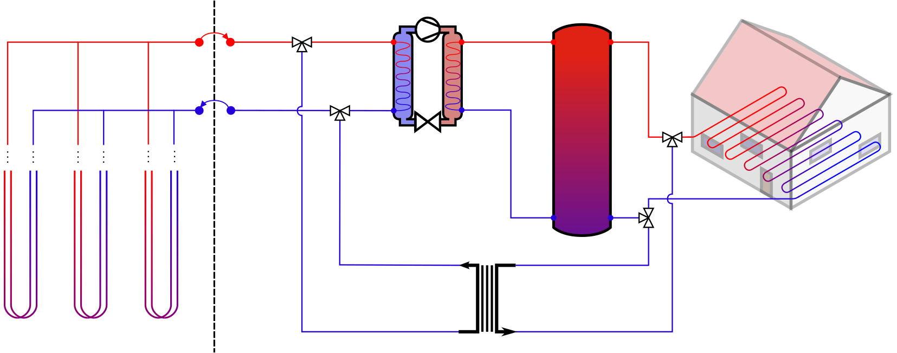

# OGS-Modelica-Interface

This interface passes information from an OpenGeoSys-Model to a Modelica-Model using the Transmission Control Protocol/Internet Protocol. The Co-simulation is controlled by _ProgrammAndServerControl.py which starts a communication server, SimulationX (client) and OGS (client) as well as handeling the information transfer and saving the results.

## Requirements
To successfully run _ProgrammAndServerControl.py without further adaptations SimulationX 4.3 as well as the GreenCity and InterfacesGeneral librarys have to be available. The Modelica model uses some custome componets based on the mentioned librarys that are included (Modelica-Model/CustomeComponents) and custome data (Modelica-Model/Data) that needs to be referenced.

## Simulation models
The Modelica model simulates a single family home that is thermally supplied by a heating system consisting of a heat pump, a heat storage, a plate heat exchanger (for cooling) and floor heating. The OGS model includes three double U-pipe borehole heat exchangers with a length of 100 m and the surrounding soil.

